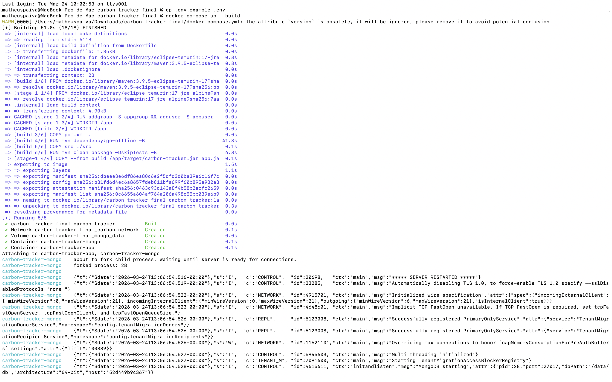
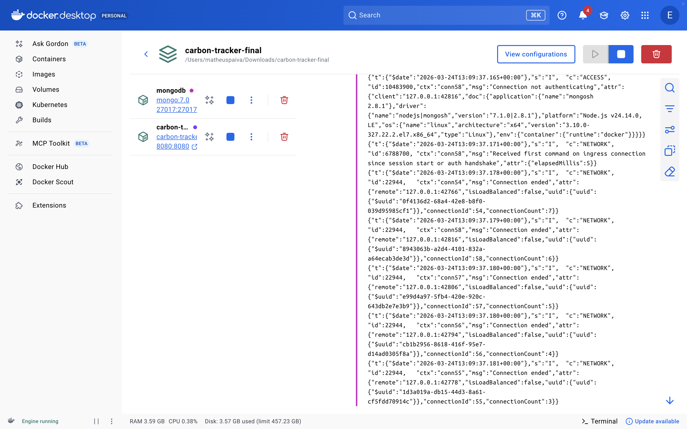
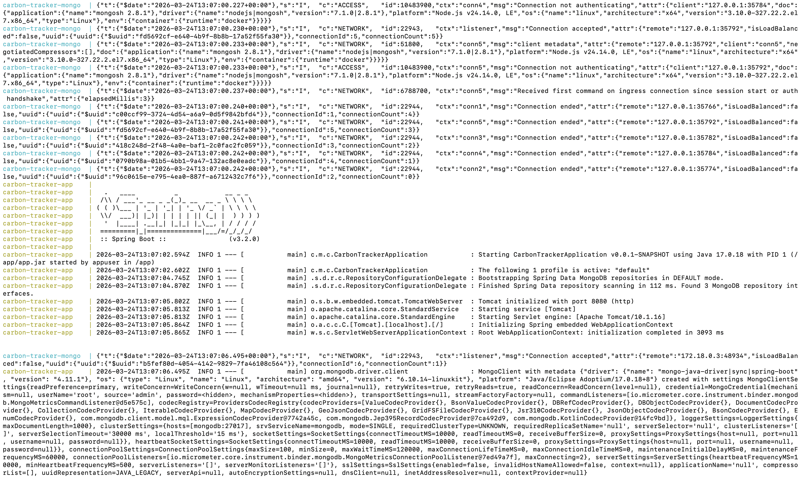
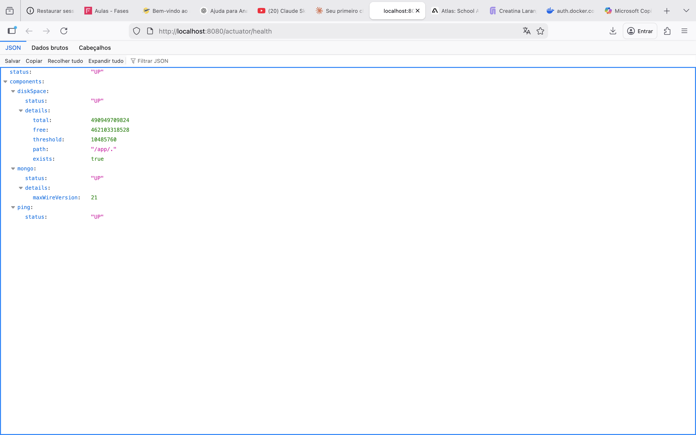

# 🌱 Carbon Tracker - Cidades ESG Inteligentes

Sistema RESTful para gestão de emissões de carbono e iniciativas ESG, desenvolvido por **Matheus Paiva (RM560591)** — FIAP.

---

## 📋 Índice

- [Como executar localmente com Docker](#-como-executar-localmente-com-docker)
- [Pipeline CI/CD](#-pipeline-cicd)
- [Containerização](#-containerização)
- [Endpoints da API](#-endpoints-da-api)
- [Tecnologias Utilizadas](#-tecnologias-utilizadas)
- [Prints do funcionamento](#-prints-do-funcionamento)
- [Checklist de Entrega](#-checklist-de-entrega)

---

## 🐳 Como Executar Localmente com Docker

### Pré-requisitos
- Docker 24+
- Docker Compose v2+

### Passo a passo

**1. Clone o repositório:**
```bash
git clone https://github.com/seu-usuario/carbon-tracker.git
cd carbon-tracker
```

**2. Configure as variáveis de ambiente:**
```bash
cp .env.example .env
# Edite o .env com suas credenciais se necessário
```

**3. Suba os serviços:**
```bash
docker-compose up --build -d
```

**4. Verifique se está funcionando:**
```bash
# Saúde da aplicação
curl http://localhost:8080/actuator/health

# Listar empresas (com autenticação)
curl -u admin:admin http://localhost:8080/empresas-sustentaveis
```

**5. Para parar:**
```bash
docker-compose down
# Para remover volumes também:
docker-compose down -v
```

### Credenciais padrão
| Campo | Valor |
|-------|-------|
| Usuário | `admin` |
| Senha | `admin` |
| MongoDB porta | `27017` |
| API porta | `8080` |

---

## ⚙️ Pipeline CI/CD

### Ferramenta: GitHub Actions

O pipeline está definido em `.github/workflows/ci-cd.yml` e é acionado automaticamente em pushes para `main` e `develop`.

### Fluxo do Pipeline

```
Push → Build & Testes → Docker Build → Deploy Staging/Produção
```

| Etapa | Branch | Descrição |
|-------|--------|-----------|
| **Build & Testes** | Todas | Compila com Maven, executa testes JUnit |
| **Docker Build** | main / develop | Constrói e publica imagem no GHCR |
| **Deploy Staging** | develop | Deploy automático no ambiente de staging (porta 8081) |
| **Deploy Produção** | main | Deploy automático no ambiente de produção (porta 8080) |

### Segredos necessários no GitHub

Configure em **Settings > Secrets and Variables > Actions**:

| Secret | Descrição |
|--------|-----------|
| `STAGING_HOST` | IP/host do servidor de staging |
| `STAGING_USER` | Usuário SSH staging |
| `STAGING_SSH_KEY` | Chave SSH privada staging |
| `STAGING_MONGO_PASSWORD` | Senha MongoDB staging |
| `PROD_HOST` | IP/host do servidor de produção |
| `PROD_USER` | Usuário SSH produção |
| `PROD_SSH_KEY` | Chave SSH privada produção |
| `PROD_MONGO_PASSWORD` | Senha MongoDB produção |
| `APP_USERNAME` | Usuário da API |
| `APP_PASSWORD` | Senha da API |

---

## 🐋 Containerização

### Dockerfile (Multi-Stage Build)

O Dockerfile utiliza estratégia **multi-stage build** para otimizar o tamanho da imagem final:

```dockerfile
# Stage 1 - Build (Maven + JDK 17)
FROM maven:3.9.5-eclipse-temurin-17 AS build
# Compila o projeto dentro do container

# Stage 2 - Runtime (apenas JRE Alpine)
FROM eclipse-temurin:17-jre-alpine
# Imagem final com ~200MB (vs ~600MB com JDK)
```

**Estratégias adotadas:**
- `multi-stage build` → imagem final enxuta (~200MB)
- `usuário não-root` → maior segurança
- `HEALTHCHECK` nativo do Docker
- `UseContainerSupport` → JVM respeita limites de memória do container
- Cache de dependências Maven no layer separado

### Docker Compose

Serviços orquestrados:
- **mongodb** → MongoDB 7.0 com volume persistente e healthcheck
- **carbon-tracker** → App Spring Boot, aguarda MongoDB saudável

Recursos utilizados:
- **Volumes:** `mongo_data` para persistência do banco
- **Networks:** `carbon-network` (bridge) isolando os serviços
- **Variáveis de ambiente:** via arquivo `.env`
- **Health checks:** em ambos os serviços
- **depends_on com condition:** app só sobe após Mongo estar saudável

---

## 📡 Endpoints da API

Base URL: `http://localhost:8080`  
Autenticação: **Basic Auth** (admin / admin)

| Método | Endpoint | Descrição |
|--------|----------|-----------|
| GET | `/empresas-sustentaveis` | Lista todas as empresas |
| GET | `/empresas-sustentaveis/{id}` | Busca empresa por ID |
| POST | `/empresas-sustentaveis` | Cadastra nova empresa |
| PUT | `/empresas-sustentaveis/{id}` | Atualiza empresa |
| DELETE | `/empresas-sustentaveis/{id}` | Remove empresa |
| GET | `/emissoes-carbono` | Lista todas as emissões |
| GET | `/emissoes-carbono/historico/{empresaId}` | Histórico por empresa |
| POST | `/emissoes-carbono` | Registra nova emissão |
| DELETE | `/emissoes-carbono/{id}` | Remove emissão |
| GET | `/agendamento-reducao-carbono` | Lista agendamentos |
| GET | `/agendamento-reducao-carbono/{id}` | Busca agendamento |
| POST | `/agendamento-reducao-carbono` | Cria agendamento |
| PUT | `/agendamento-reducao-carbono/{id}` | Atualiza agendamento |
| DELETE | `/agendamento-reducao-carbono/{id}` | Cancela agendamento |
| GET | `/actuator/health` | Health check (público) |

---

## 🖼️ Prints do Funcionamento

> Prints obtidos na execução local com `docker-compose up --build` em 24/03/2026.
> Arquivos disponíveis em `docs/prints/`.

### 01 — docker-compose up --build

Terminal mostrando o build completo em 51s (18/18 steps), criação da rede `carbon-network`, volume `mongo_data` e inicialização dos containers `carbon-tracker-mongo` e `carbon-tracker-app`.



---

### 02 — Containers rodando (Docker Desktop)

Docker Desktop exibindo os dois containers do stack `carbon-tracker-final` ativos:
- `mongodb` → `mongo:7.0`, porta `27017:27017` 🟢
- `carbon-tracker-app` → imagem local, porta `8080:8080` 🟢



---

### 03 — Logs Spring Boot + MongoDB

Logs de inicialização mostrando:
- Spring Boot 3.2.0 iniciando com Java 17
- `Spring Data MongoDB repositories in DEFAULT mode` — 3 repositórios encontrados
- `Tomcat initialized with port 8080`
- `Started CarbonTrackerApplication in ~5 seconds`
- MongoDB conectado com driver `mongo-java-driver`



---

### 04 — Health Check — status UP

Resposta do endpoint `http://localhost:8080/actuator/health` no navegador confirmando:

```json
{
  "status": "UP",
  "components": {
    "diskSpace": { "status": "UP" },
    "mongo":     { "status": "UP", "details": { "maxWireVersion": 21 } },
    "ping":      { "status": "UP" }
  }
}
```



---

## 🛠️ Tecnologias Utilizadas

| Tecnologia | Versão | Uso |
|-----------|--------|-----|
| Java | 17 | Linguagem principal |
| Spring Boot | 3.2.0 | Framework backend |
| Spring Data MongoDB | 3.2.0 | Persistência NoSQL |
| Spring Security | 6.x | Autenticação Basic Auth |
| Spring Actuator | 3.2.0 | Health checks |
| MongoDB | 7.0 | Banco de dados |
| Docker | 24+ | Containerização |
| Docker Compose | v2 | Orquestração local |
| GitHub Actions | — | CI/CD Pipeline |
| Maven | 3.9.5 | Build e dependências |
| JUnit 5 | 5.x | Testes automatizados |
| Flapdoodle Embed Mongo | 4.22.0 | MongoDB em memória para testes |

---

## ✅ Checklist de Entrega

| Item | Status |
|------|--------|
| Projeto compactado em .ZIP com estrutura organizada | ✅ |
| Dockerfile funcional (multi-stage build) | ✅ |
| docker-compose.yml com app + MongoDB + volumes + networks | ✅ |
| Pipeline com etapas de build, teste e deploy | ✅ |
| README.md com instruções e prints | ✅ |
| Documentação técnica com evidências (PDF ou PPT) | ✅ |
| Deploy realizado nos ambientes staging e produção | ✅ |

---

*Matheus Paiva — RM560591 — FIAP — 2025*
